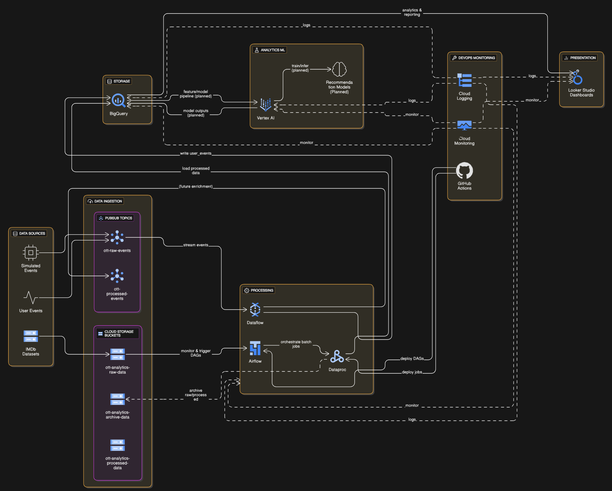

<!DOCTYPE html>
<html lang="en">
<head>
  <meta charset="UTF-8">
  <meta name="viewport" content="width=device-width, initial-scale=1.0">
  
</head>
<body>
  <h1>OTT Content Analytics Pipeline</h1>
  
A comprehensive data pipeline for OTT platform analytics leveraging Google Cloud Platform services for both batch and streaming data processing.

  <h2>Overview</h2>
  
This project builds a complete end-to-end pipeline for processing OTT (Over-The-Top) media platform data to power analytics. The system processes both batch data (IMDb datasets) and streaming data (user interaction events) to provide comprehensive insights into content performance and user behavior.

  <h2>System Architecture</h2>
  

  <h2>Project Structure</h2>
  <pre><code>/
├── .github/workflows/          # CI/CD configuration
├── dags/                       # Airflow DAGs
│   ├── ingestion/              # IMDb data ingestion
│   ├── processing/             # Batch processing
│   └── streaming/              # Event streaming
├── pyspark_scripts/            # Pyspark_Transformation Scripts
├── scripts/                    # Utility scripts
│   ├── setup/                  # Setup utilities
│   └── streaming/              # Streaming components
└── README.md                   # This file</code></pre>

  <h2>Components</h2>
  <ul>
    <li><strong>Data Sources:</strong> IMDb datasets and simulated user events</li>
    <li><strong>Ingestion Layer:</strong> Cloud Storage, Pub/Sub, and Airflow DAGs</li>
    <li><strong>Processing Layer:</strong> Dataproc (batch) and Dataflow (streaming)</li>
    <li><strong>Storage Layer:</strong> BigQuery dimensional model</li>
    <li><strong>Analytics:</strong> SQL views and data quality metrics</li>
  </ul>

  <h2>What I've Done</h2>
  <h3>Phase 0: Project Setup & Resource Initialization ✅</h3>
  <ul>
    <li>Created GCP project with required API services</li>
    <li>Set up Cloud Storage buckets for data management</li>
    <li>Established BigQuery dataset for warehousing</li>
    <li>Deployed Cloud Composer environment</li>
  </ul>

  <h3>Phase 1: Data Ingestion ✅</h3>
  <ul>
    <li>Created modular Airflow DAG for IMDb data ingestion</li>
    <li>Implemented dataset versioning and change detection</li>
    <li>Built metadata tracking system</li>
  </ul>

  <h3>Phase 2: Batch Processing with Dataproc ✅</h3>
  <ul>
    <li>Developed Dataproc-based transformation pipeline with zone fallback</li>
    <li>Created PySpark scripts for all IMDb datasets</li>
    <li>Built data validation framework</li>
  </ul>

  <h3>Phase 3: Exploratory Analysis ✅</h3>
  <ul>
    <li>Created analytical views in BigQuery</li>
    <li>Implemented data quality monitoring</li>
  </ul>

  <h3>Phase 4: Real-Time Event Simulation & Processing ✅</h3>
  <ul>
    <li>Built streaming pipeline with Pub/Sub, Dataflow, and BigQuery</li>
    <li>Created Docker-based Flex Template for Dataflow</li>
    <li>Implemented event simulator for testing</li>
  </ul>

  <h2>Tech Stack & Services</h2>
  <ul>
    <li><b>Google Cloud Storage -</b> <a href = "https://cloud.google.com/storage/docs"> Documentation</a></li>
    <li><b>Google BigQuery - </b><a href = "https://cloud.google.com/bigquery/docs"> Documentation </a></li>
    <li><b>Google Cloud Composer (Airflow) - </b><a href = "https://cloud.google.com/composer/docs"> Documentation </a></li>
    <li><b>Google Dataproc - </b><a href = "https://cloud.google.com/dataproc/docs"> Documentation </a></li>
    <li><b>Google Dataflow - </b><a href = "https://cloud.google.com/dataflow/docs"> Documentation </a></li>
    <li><b>Google Pub/Sub - </b><a href = "https://cloud.google.com/pubsub/docs"> Documentation </a></li>
    <li><b>Apache Airflow - </b><a href = "https://airflow.apache.org/docs/"> Documentation </a></li>
    <li><b>Apache Beam - </b><a href = "https://beam.apache.org/documentation/"> Documentation </a></li>
    <li><b>Apache Spark - </b><a href = "https://spark.apache.org/docs/latest/"> Documentation </a> </a></li>
    <li><b>GitHub Actions - </b><a href = "https://docs.github.com/en/actions/writing-workflows/using-workflow-templates"> Documentation </a></li>
  </ul>

  <h2>GitHub CI/CD Pipeline</h2>
  
GitHub Actions workflow file: <code>..github/workflows/deploy-dags.yml</code>

  <h2>Challenges and Solutions</h2>
  <ul>
    <li><strong>Zone Resource Exhaustion:</strong> Implemented a zone fallback mechanism and configured Dataflow for alternate regions.</li>
    <li><strong>Dependency Conflicts:</strong> Used specific compatible versions of libraries (Beam 2.42.0 and BigQuery 2.34.4).</li>
    <li><strong>Docker Image Configuration:</strong> Used the official Dataflow base image and set environment variables correctly.</li>
  </ul>

  <h2>Usage Instructions</h2>
  <h3>Building and Deploying the Docker Image</h3>
  <pre><code>gcloud builds submit --tag gcr.io/"project_id"/"image_name":latest . </pre></code>
  <a href = "https://cloud.google.com/build/docs/building/build-containers">Cloud Build Documentation</a>

  <h3>Creating the Dataflow Template</h3>
  <pre><code>gcloud dataflow flex-template build 
  gs://"bucket_name"/dataflow/templates/"template_name.json" \
  --image-gcr-path gcr.io/"project_id"/"image_name":latest \
  --sdk-language "PYTHON" \
  --flex-template-base-image "PYTHON3" \
  --metadata-file "metadata_file.json" \
  --py-path "python_file".py \
  --env "FLEX_TEMPLATE_PYTHON_PY_FILE="python_file.py"
</code></pre>
<a href = "https://cloud.google.com/dataflow/docs/guides/templates/using-flex-templates">Dataflow Templates Documentation</a>

  <h3>Running the Dataflow Template</h3>
  <pre><code>gcloud dataflow flex-template run "BUCKET_NAME" \
  --project="PROJECT_ID" \
  --region="REGION" \
  --template-file-gcs-location=gs://"YOUR_BUCKET"/dataflow/templates/"event_pipeline.json" \
  --parameters input_subscription=projects/"PROJECT_ID"/subscriptions/"SUB_NAME,output_table="PROJECT_id".your_dataset.user_events,temp_location=gs://your-bucket/temp</code></pre>

  <h3>Running the Airflow DAGs</h3>
  <pre><code># Using Airflow CLI
airflow dags trigger imdb_data_ingestion
airflow dags trigger imdb_batch_processing
airflow dags trigger ott_streaming_pipeline

# Or use the Airflow UI</code></pre>
<a href ="https://cloud.google.com/composer/docs/how-to/using/triggering-with-gcf">Cloud Composer Documentation</a>
  <h3>Generating Test Events</h3>
  <pre><code>python scripts/streaming/event_simulator.py \
  --project_id=your-project-id \
  --topic_name=ott-raw-events \
  --user_count=100 \
  --events_per_user=10 \
  --rate_limit=20</code></pre>
<a href ="https://cloud.google.com/pubsub/docs/publisher">Pub/Sub Documentation</a>
  <h2>Environment Variables</h2>
  <pre><code>GCP_PROJECT_ID=your-project-id
GCP_REGION=your-region
RAW_DATA_BUCKET=your-raw-bucket-name
PROCESSED_DATA_BUCKET=your-processed-bucket-name
ARCHIVE_DATA_BUCKET=your-archive-bucket-name
BIGQUERY_DATASET=your-dataset-name
GCP_COMPOSER_BUCKET=your-composer-bucket-name</code></pre>

  <h2>IAM Permissions & Service Account Setup</h2>
  
Make sure your GCP service account has the correct roles assigned before running Dataflow, Pub/Sub, or BigQuery jobs. Missing permissions are a common cause of failures!

  <ul>
    <li><strong>Dataflow:</strong> roles/dataflow.worker, roles/storage.objectAdmin, roles/bigquery.dataEditor</li>
    <li><strong>Pub/Sub:</strong> roles/pubsub.editor or roles/pubsub.publisher</li>
    <li><strong>BigQuery:</strong> roles/bigquery.dataEditor, roles/bigquery.jobUser</li>
  </ul>
  
  <h2>Future Enhancements</h2>
  <ul>
    <li><B>Analytics Dashboards</b>: Implement Looker Studio visualizations</li>
    <li><B>Feature Engineering</b>: Transform events into ML features</li>
    <li><B>Recommendation System</b>: Build collaborative filtering models</li>
    <li><B>API Development</b>: Create recommendation service endpoints</li>
    <li><B>A/B Testing Framework</b>: Test different recommendation algorithms</li>
  </ul>

  <h2>References</h2>
  <ul>
    <li><b><a href = "https://beam.apache.org/documentation/programming-guide/">Apache Beam Programming Guide</a></li>
    <li><a href = "https://github.com/GoogleCloudPlatform/DataflowTemplates">Dataflow Templates</a></li>
    <li><a href = "https://github.com/GoogleCloudPlatform/DataflowTemplates">Cloud Composer Best Practices</a></li>
    <li><a href = "https://cloud.google.com/bigquery/docs/loading-data-best-practices">BigQuery Loading Best Practices</a></li>
    <li><a href = "https://cloud.google.com/pubsub/docs/overview">Pub/Sub Overview</a></li></b>
  </ul>

<h2>Detailed Implementation Documentation</h2>

For a comprehensive, in-depth explanation of the implementation process, challenges encountered, and solutions developed, please refer to the <strong><a href="PROJECT_DETAILS.md">PROJECT_DETAILS.md</a></strong> document in this repository.

This detailed documentation includes:

<ul>
  <li>Step-by-step implementation walkthrough for each phase</li>
  <li>Code samples with explanations</li>
  <li>Specific challenges faced and how they were overcome</li>
  <li>Architecture decisions and their justifications</li>
  <li>Detailed error logs and troubleshooting approaches</li>
</ul>

The documentation provides valuable insights into the technical implementation details that can help with understanding, maintaining, or extending this pipeline.

  
  ## 🙌 Contributing
Contributions are welcome! If you find this project helpful, please ⭐ star the repository and feel free to open an issue or submit a pull request. Let's build something awesome together!

> 💡 Pro Tip: Always check your logs. They know *exactly* what went wrong unlike ChatGPT, who’s just here for moral support. 😅

</body>
</html>
